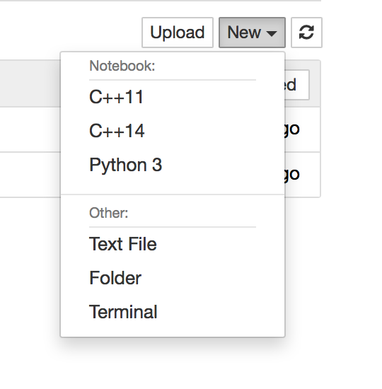
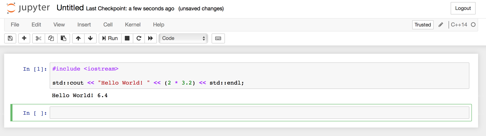

# Vagrant dev env for using Jupyter notebooks with C++

A quick way to use the Jupyter C++ kernel:

- https://blog.jupyter.org/interactive-workflows-for-c-with-jupyter-fe9b54227d92
- https://github.com/QuantStack/xeus-cling
- https://uwekorn.com/2017/12/17/play-interactively-with-arrow-cpp-in-xeus-cling.html

## Prerequisites

Install Vagrant from <https://www.vagrantup.com>.

*Tip*: If you're using macOS with [Homebrew](https://brew.sh), run `brew cask install vagrant`.

## Running

1. Run `vagrant up` in this repository
2. Wait for a few minutes while the downloads and installation are happening
3. Open the link displayed in your web browser
4. Create new notebook with the `C++11` or `C++14` kernel

   

5. Follow the examples at https://github.com/QuantStack/xeus-cling#usage

   
